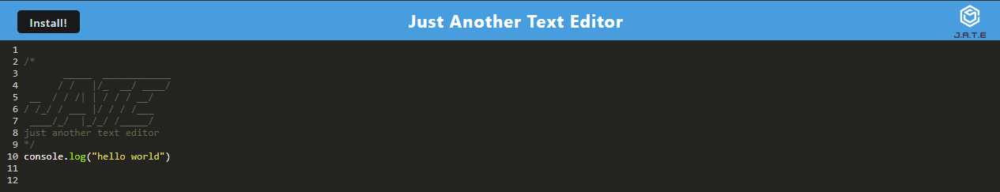
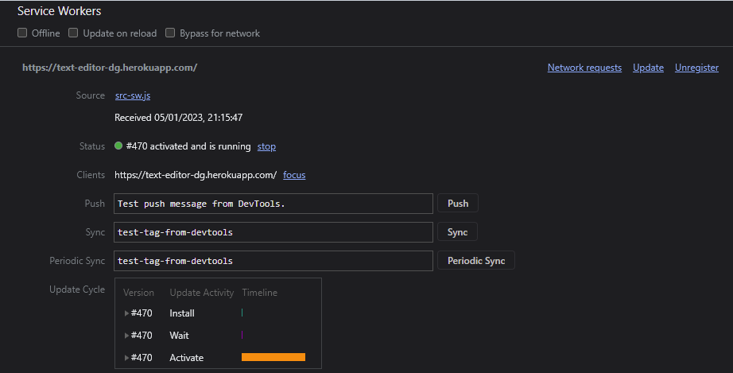
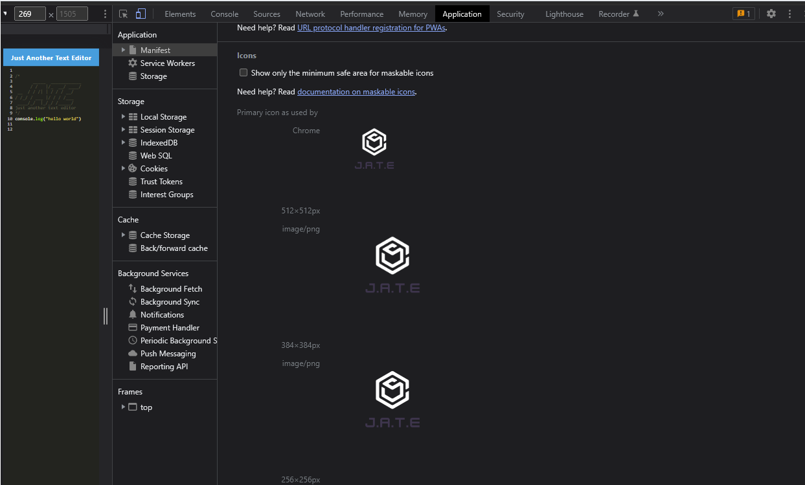
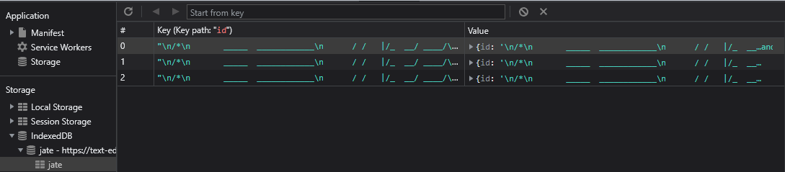

# TextEditor

Text Editor

# ABOUT

This is an online text editor allowing users to write code snippits and store them in the browser for use later. This PWA app allows users to download the program and run it locally or offline using webpack.

The download button allows the user to use a copy of th eapp locally using chrome tools.

Service Workers

Manifest.json

IndexedDB is used to store data as objects in the browser.

# LICENSE

The MIT License text can be found at https://opensource.org/licenses/MIT or within the <a href="./LICENSE">MIT License</a> file.

# REPO

https://github.com/Web3Zero/TextEditor
